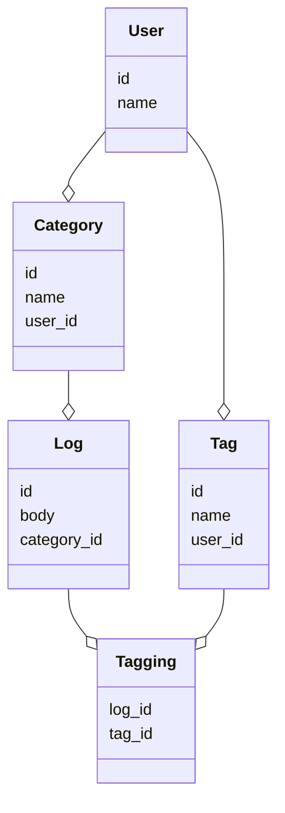

# Logbook

## Elixir setup

* [Install with homebrew](https://elixir-lang.org/install.html#macos)
* Open `psql` console
* Run `CREATE ROLE postgres LOGIN CREATEDB;`

## Getting it up

To start your Phoenix server:

  * Install dependencies with `mix deps.get`
  * Create and migrate your database with `mix ecto.setup`
  * Start Phoenix endpoint with `mix phx.server` or inside IEx with `iex -S mix phx.server`

Now you can visit [`localhost:4000`](http://localhost:4000) from your browser.

Ready to run in production? Please [check our deployment guides](https://hexdocs.pm/phoenix/deployment.html).

## Where to design

Write your sass in `assets/css/app.scss`. If you need to add other sass files, I'm not sure if it'll work automagically or if we'll have to update the configuration.

`lib/logbook_web/templates/layout` is where you'll find the page layout and it looks like some other navigation and flash message stuff is in there.

`lib/logbook/web/templates/[other_folders]` have what you'd expect in `views` in a Rails app. `views` in Phoenix is more akin to `helpers` in Rails, I think.

## Modeling tags and categories

The minimum I think is acceptable to make sure we can keep track of unique tag names by user is that we have to include the user_id on the Tag. This allows us to only store unique (by case insensitive) names for tags, but make them unique by user rather than across the whole system. This way if one user creates a "Basketball" tag and another creates "BasketBall", they will not clash with each other.

The alternative is to not bother with case insensitive. The problem here is, while there would be a unique tag entry for "Basketball" and "BasketBall" respectively, it also means a single user could have multiple tags with different cases. That would be confusing for an individual user to have both "Basketball" and "BasketBall" tags, organized uniquely.

## Learn more about Phoenix

  * Official website: https://www.phoenixframework.org/
  * Guides: https://hexdocs.pm/phoenix/overview.html
  * Docs: https://hexdocs.pm/phoenix
  * Forum: https://elixirforum.com/c/phoenix-forum
  * Source: https://github.com/phoenixframework/phoenix
